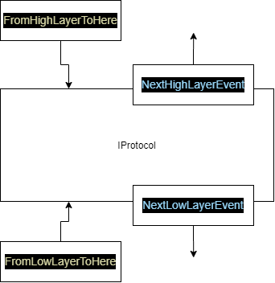
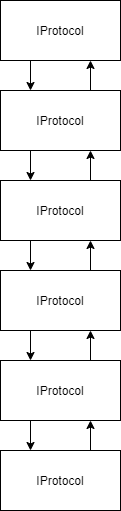
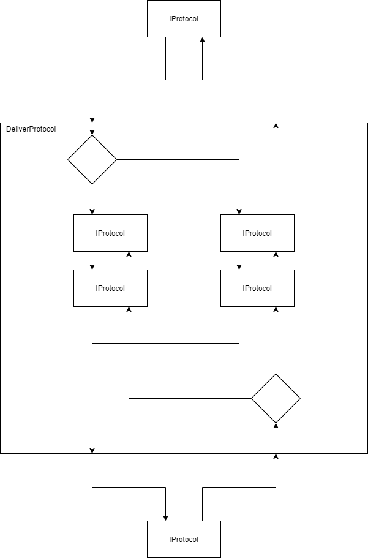

# SocketApp.ProtocolStack

Protocol stack is the additional layers built on top of the Transport Layer. It helps socket connection add security layer easier and neater and decouple logic between different layers. In order words, those security logic could be departed from the business logic and make them independent from each other.

Rather than a concrete implementation, it could be a solution for the common problem.

## Terms

The term "protocol" and "layer" refer to the same thing.

## Principle

Any protocol should be inherited from `IProtocol`.

The protocol stack supposes the higher the application layer and the lower the physical layer.

`DataContent` is the only data structure that passes through all additional layers.

`ProtocolStack` represents a pile of protocols. It could help link protocols together.

The whole idea is borrowed from the middleware system of ASP.NET Core. this protocol system is also bidirectional and short-circuit-able. However, this protocol system could have a branching control flow, though the branches must rejoin eventually.

Considering the potential nested structure inside a protocol stack, the injection mechanism is difficult to implement. Thus, a custom factory or builder is needed.

## `IProtocol`

Learn more from interface `IProtocol`.

## `ProtocolStack`

Learn more from class `ProtocolStack`.

## `DeliverProtocol`

If you want to do a branching of protocol stacks, you might use the abstract class `DeliverProtocol`:

## Caution

If any instance of `IProtocol` is adapted in a `ProtocolStack`, the instance should NOT be added into another `ProtocolStack` to avoid unexpected data flow among independent `ProtocolStack`s.

## TODO

- [ ] ~~Build an ASP.NET Core-like dependency injection mechanism.~~
